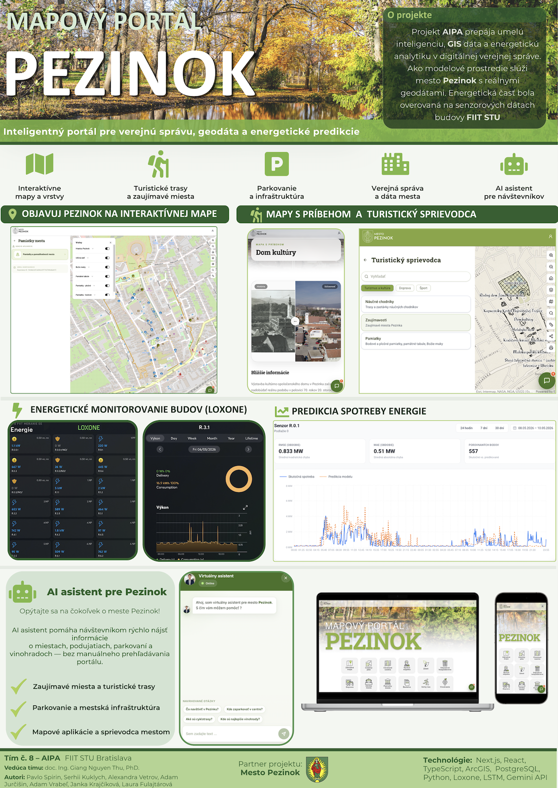

# AIPA — AI in Public Administration

Digitalizácia verejnej správy je jednou z kľúčových výziev modernej spoločnosti. S rastúcim množstvom dát a potrebou efektívneho rozhodovania sa stáva využitie umelej inteligencie nevyhnutnosťou. Mestá a obce generujú obrovské množstvo dát z rôznych zdrojov - od senzorových systémov na monitorovanie spotreby energie, cez geografické informačné systémy až po administratívne záznamy.
Tento projekt vznikol v spolupráci s mestom Pezinok s cieľom vytvoriť inovatívne riešenia pre digitálnu transformáciu mestskej správy. Pezinok, ako dynamicky sa rozvíjajúce mesto v blízkosti Bratislavy, predstavuje ideálneho partnera pre pilotné nasadenie smart city riešení.

---

## Repozitáre

### [aipa-frontend](https://github.com/FIIT-TP-2025/aipa-frontend)
Hlavná webová aplikácia. Poskytuje interaktívny mapový portál s integráciou ArcGIS, prehľadové panely so senzorovými údajmi, monitorovanie spotreby energie a administrátorský panel na správu obsahu.

### [aipa-docs](https://github.com/FIIT-TP-2025/aipa-docs)
Špecializovaná stránka, ktorá predstavuje tím stojací za projektom – členov, ich úlohy a príspevky.

### [aipa-loxone-fetcher](https://github.com/FIIT-TP-2025/aipa-loxone-fetcher)
Služba na získavanie údajov, ktorá zhromažďuje merania senzorov zo systému Loxone a odosiela ich do hlavnej aplikácie.

### [timeseries_data_prediction_overview](https://github.com/FIIT-TP-2025/timeseries_data_prediction_overview)
Výskum a implementácia modelu strojového učenia na predpovedanie spotreby elektrickej energie na základe časových radov.
